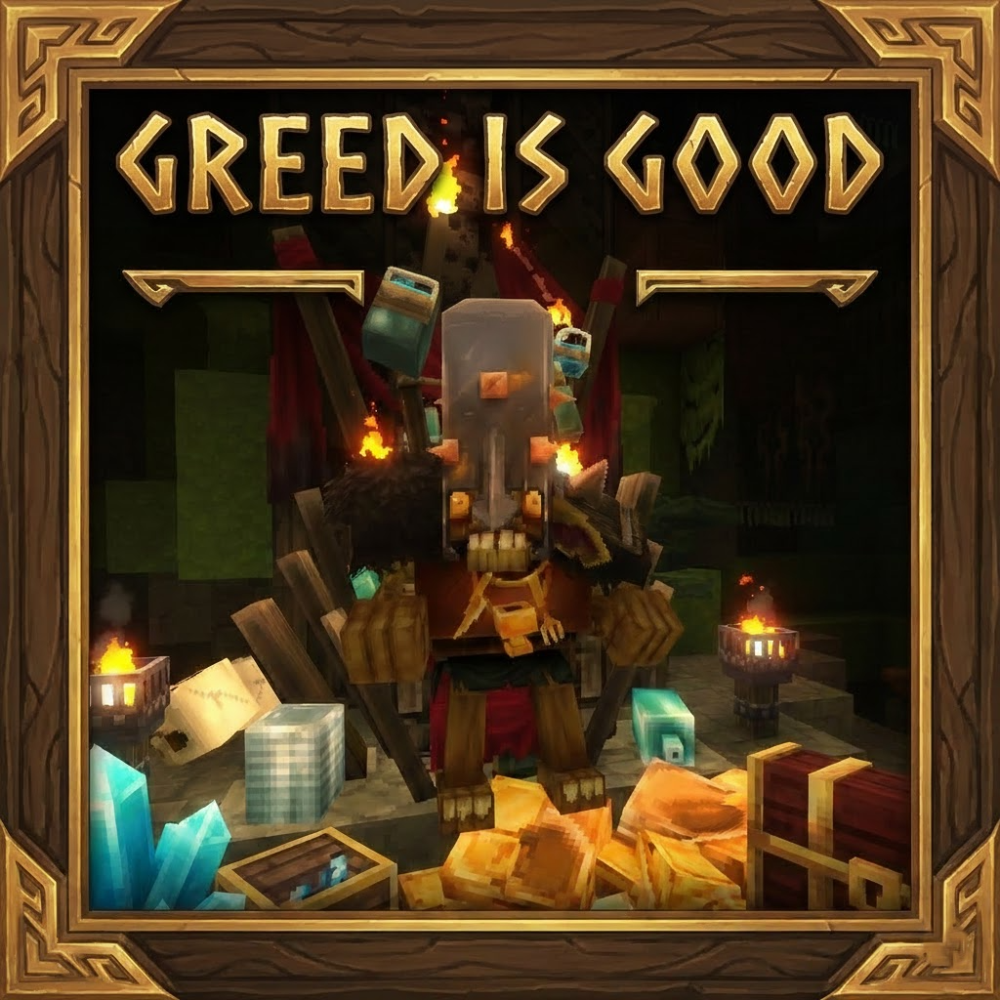

# 💰 Greed Is Good

> **"Greed, for lack of a better word, is good."**  
> *Don't let any gold go to waste. Scrape every coin from the dungeon floors!*

  

## 📖 About The Mod / О Моде

**Greed Is Good** is a simple yet essential economy balance mod for Hytale. It solves the problem of "useless shiny junk" found in dungeons. Why keep a decorative pile of gold when you can melt it down into something useful?

**Greed Is Good** — это простой, но важный мод для экономики Hytale. Он решает проблему "бесполезного блестящего мусора" в данжах. Зачем хранить декоративную кучу золота, если её можно переплавить во что-то полезное?

### ✨ Features / Особенности

This mod introduces a **Salvage Workflow** for treasure items:
Мод добавляет цепочку **Утилизации** для сокровищ:

| Input Item (Trash) | Process | Output (Reward) |
| :--- | :---: | :--- |
| 🏺 **Large Treasure Pile** | ➡️ **Salvage Bench** ➡️ | **1x** Gold Ore (Руда) |
| 💰 **Small Treasure Pile** | ➡️ **Salvage Bench** ➡️ | **1x** Gold Ore (Руда) |
| ⚱️ **Treasure Object** | ➡️ **Salvage Bench** ➡️ | **1x** Gold Ore (Руда) |

## 🛠 Installation / Установка

1.  Download the `GreedIsGood` folder or zip archive.
2.  Place it into your Hytale mods directory: `Hytale/mods/`.
3.  Launch the game and get rich!

## 🐛 Known Issues / Известные Баги

*   **Visual Glitch:** Occasionally, the progress bar in the Salvage Bench may appear stuck visually after relogging. The processing usually continues in the background.
    *   *Редко полоска прогресса в верстаке может визуально зависать после перезахода на сервер.*

## 🤝 Contributing

Feel free to open an Issue or Pull Request if you want to add more "valuable junk" to the salvage list!
Если хотите добавить больше предметов для переработки — смело пишите в Issues!

---
*Created by Loocik*

